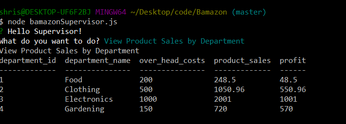

# Bamazon

* Bamazon is CLI app which takes user inputs to provide data regarding products & departments tables
* It takes 3 commands - BamazonCustomer, BamazonManger & BamazonSupervisor

## bamazonCustomer

* This view provides opportunity to customer to buy any product from teh current products table

* It asks for product_id & quantity and updates the table accordingly

## bamazonManager

* This view provides followign options

* View products for sale along with the sales so far

* View items in the inventory with count < 5

* Add quantity to existing items

* Add new product

## bamazonSupervisor

* This view provides following options

* The supervisor can see the sales by department

* Add new department
